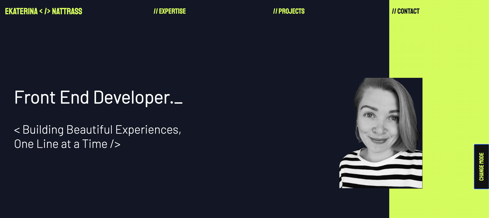
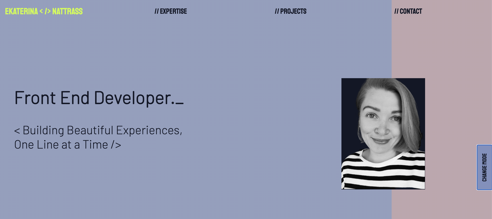

# Portfolio

</img>
</img>

One-page portfolio website with links to the projects and Github repoes. The website also has the dark and light modes. 

## Website

[Rainydays website](https://peppy-froyo-40c9b0.netlify.app)

## Description

The project contains everal sections:

- home
- expertise
- projects
- contact

## Tech Stack

The project was built with:

- HTML 5
- CSS
- Javascript

## Getting started

### Installing

1. Clone the repo:

`git@github.com:EkaterinaNattrass/Portfolio.git`

### Running

The project contains only static files, you can find the index page at `index.html`.

### Contributing

This is a portfolio website, demonstrating my own expertise and skills, therefore there have been no external contributions.

## Contact

cattiva2012@gmail.com
